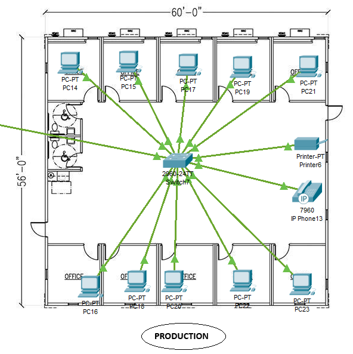

## Part 1 - Network Diagram and Architecture

### 1. Introduction
The network architecture is structured into five distinct sectors: Management, Study, Production, Support 1, and Support 2. Each department is allocated its own VLAN to ensure traffic segmentation, preventing unauthorized lateral movement between departments and reducing the attack surface in case of a breach.

### 2. Key architectural components
- **Management VLAN**: Responsible for administrative operations, housing 5 computers, a printer, and IP phone. Segmentation via VLAN isolates these from production sectors, minimizing risk 

- **Study VLAN**: Contains 8 computers and a printer, supporting research and study operations. 

- **Production VLAN**: Consists of 10 workstations and handles the core production tasks. Production areas have the highest number of computers, which is appropriate given their workload 

- **Support 1 and Support 2 VLANs**: Each support sector contains 10 computers, supporting technical and customer service operations. 
 
- **Server Room**: 4 servers (DNS, DHCP, FTP, RADIUS), 2 routers, 1 multilayer switch, 1 switch. Centralizing servers and key devices is essential for security, organization, and access control. 

By strategically placing switches and routing traffic via Layer 3 switches, we’ve ensured that the network is both scalable and efficient without requiring additional routing hardware.

### 3. Justification for Architecture:
- **VLAN Segmentation**: Each department (Management, Study, Production, Support) is on a different VLAN, which ensures that sensitive data is isolated.
- **Layer 3 Switches**: These handle inter-VLAN routing, which is more cost-effective than adding extra routers.
- **Centralized Servers**: All of the processing is controlled in a central location
- **Scalability**: The architecture is scalable, allowing new devices or sectors to be added with minimal reconfiguration.
