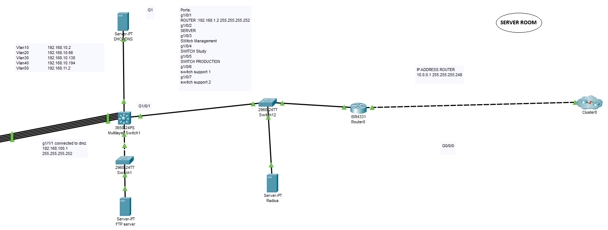

## Part 4 - Security Measures

Security was a primary focus throughout the network design process, with several measures implemented to protect the network from both internal and external threats:

- **VLAN Segmentation**: Each department is separated by VLAN, ensuring that sensitive information from departments like Management cannot be accessed by other departments like Production or Support. This segmentation reduces the attack surface and enhances overall network security. VLAN segmentation not only improves performance by reducing broadcast traffic but also provides security benefits. By isolating departments in different VLANs, we reduce the risk of lateral movement in case of a breach. For example, if malware infects a device in the Study VLAN, it cannot spread to other departments such as Management or Production. This is crucial for preventing the spread of internal phishing attacks or unauthorized data access.

- **Access Control Lists (ACLs)**: We have implemented strict ACLs on inter-VLAN traffic to control which devices can communicate across VLANs. For instance, Production VLAN traffic is blocked from accessing resources on the Management VLAN except for specific exceptions, such as print services. Access Control Lists (ACLs) are a critical security measure to prevent unauthorized traffic between VLANs. They help block IP spoofing by ensuring that only trusted devices can communicate between sectors. For example, we’ve implemented ACLs to block all SSH traffic to Management VLAN devices from untrusted IP ranges, thereby reducing the attack surface and preventing potential exploitation of management resources.

- **RADIUS Authentication**: The RADIUS server centralizes authentication, requiring users to authenticate before accessing any critical network device. This minimizes the risk of compromised devices, enforces strong password policies, and provides centralized management of user credentials.

- **Strong Password Policies and Encryption**: We enforce strong password policies across all network devices and enable encryption protocols to secure traffic where possible, especially on the servers handling DNS, DHCP, and user authentication. This ensures that even if credentials are compromised, brute force attacks are less likely to succeed. All sensitive data traffic between servers, such as DNS and DHCP requests, is secured using AES-256 encryption. Additionally, communication between devices and the RADIUS authentication server is secured with TLS/SSL protocols to ensure data privacy and integrity during transmission. This reduces the risk of man-in-the-middle attacks and ensures compliance with best practices for securing sensitive information in transit.

- **Monitoring and Logging**: In addition to preventive security measures, real-time monitoring and logging are essential for detecting and responding to potential threats. A centralized Syslog server has been implemented to collect logs from critical network devices, allowing for real-time monitoring of network traffic and suspicious activity. Additionally, SNMP (Simple Network Management Protocol) is used to monitor network health and performance. Alerts are configured to notify administrators in case of unauthorized access attempts or abnormal traffic, providing an extra layer of defense against security breaches. 

